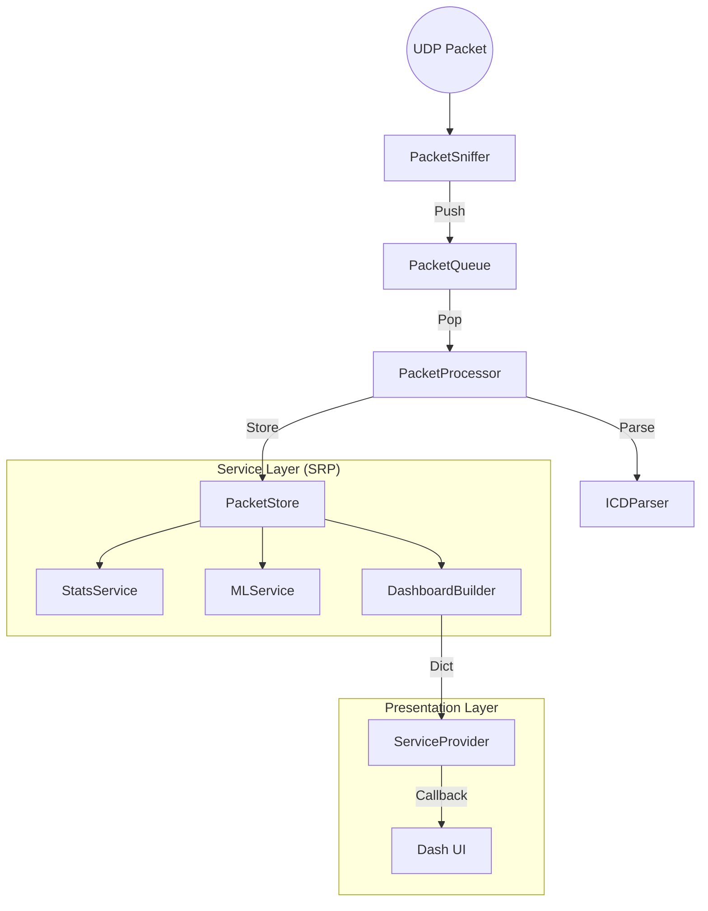

# UGV-MON: VIC↔OCS Real-time Communication Monitoring

A dashboard for **passive monitoring** of UDP communication between VIC (Vehicle Integrated Controller) and OCS (Operations Control Station).

> **Note**: This system does not transmit control packets. It performs monitoring only.

## Key Features

- **Real-time Packet Capture**: `lo` (local) or `eno2`/`eno3` (hardware) interfaces
- **ICD v1.0 Parsing**: Interprets headers, operational status, device connections, and emergency stop causes
- **Quality Metrics**: Availability, Jitter (P95), Packet Loss Rate, and PPS
- **Dashboard**: Real-time UI based on Dash + Plotly (2-second polling)
- **Bidirectional Capture**: Switch between Status (VIC->OCS) and Control (OCS->VIC) directions

## Quick Start

### 1. Installation

Requires Python 3.9+.

```bash
pip install -r requirements.txt
```

### 2. Run

#### Mock Mode (Development/Testing)

```bash
python3 run.py
python3 run.py --mode mock
```

- Verifies UI with fake data
- No network privileges required

#### Live Mode (Real Packet Capture)

```bash
# CLI Argument Method (Recommended)
sudo python3 run.py --mode live --interface lo
sudo python3 run.py --mode live --interface eno2

# Environment Variable Method
export UGV_MON_USE_LIVE=true
export UGV_MON_INTERFACE=lo
sudo -E python3 run.py
```

### 3. Access

```
http://localhost:8050
```

## CLI Options

```bash
python3 run.py --help

options:
  --mode {mock,live}, -m    Execution mode (default: mock)
  --interface, -i           Network interface (default: lo)
  --port, -p                Server port (default: 8050)
  --debug                   Enable debug mode
```

## Environment Variables

| Variable | Description | Default |
| --- | --- | --- |
| `UGV_MON_USE_LIVE` | Live mode if `true` | Mock mode |
| `UGV_MON_INTERFACE` | Capture interface | `lo` |
| `UGV_MON_PORT` | Server port | `8050` |
| `UGV_MON_DEBUG` | Debug mode | `false` |

## Project Structure

```text
RealTimeDashboard/
├── run.py                    # Unified entry point (CLI support)
├── requirements.txt          # Dependencies list
│
├── tests/                    # Unit tests
├── docs/                     # Documentation
│
└── ugv_mon/                  # Main Python package
    ├── app.py                # Dash app factory
    ├── config.py             # App configuration (env vars)
    ├── constants.py          # Constant definitions
    ├── models.py             # Data models (Enum, ICD parsing)
    ├── styles.py             # UI style constants
    │
    ├── pipeline/             # Data collection pipeline
    │   ├── sniffer.py        # PacketSniffer (Scapy)
    │   ├── queue.py          # PacketQueue (thread-safe)
    │   ├── processor.py      # PacketProcessor (parse+store)
    │   └── icd_parser.py     # ICDParser (ICD v1.0)
    │
    ├── store/                # Data storage
    │   └── packet_store.py   # Unified storage (single deque)
    │
    ├── services/             # Service layer
    │   ├── capture_service.py    # Capture control
    │   ├── stats_service.py      # Statistics/connection status
    │   ├── ml_service.py         # ML anomaly detection
    │   ├── dashboard_builder.py  # Dict(25 keys) builder
    │   └── service_provider.py   # Callback compatibility bridge
    │
    ├── analysis/             # ML Anomaly Detection
    │   ├── ml_pipeline.py
    │   ├── ml_anomaly_detector.py
    │   ├── rule_detector.py
    │   └── feature_extractor.py
    │
    ├── ui/                   # UI Modules
    │   ├── components/       # Reusable components
    │   │   ├── kpi_card.py
    │   │   ├── device_grid.py
    │   │   ├── status_chip.py
    │   │   └── log_table.py
    │   ├── layouts/          # Layouts
    │   │   ├── main_layout.py
    │   │   ├── header.py
    │   │   ├── panels.py
    │   │   ├── charts.py
    │   │   └── ml_charts.py
    │   └── ml/               # ML Visualizations
    │       ├── anomaly_3d.py
    │       ├── anomaly_timeline.py
    │       └── feature_importance.py
    │
    ├── callbacks/            # Dash Callbacks
    │   └── update_callbacks.py
    │
    └── mock/                 # ⚠️ For Dev/Testing
        ├── mock_data.py
        └── live_provider.py  # LEGACY (for compatibility)
```

## Architecture (Data Flow)



1. **Pipeline**: `Sniffer` captures packets and pushes to `Queue`, `Processor` pops them, parses, and stores in `Store`.
2. **Service**: `StatsService` and `MLService` analyze data from the `Store`.
3. **Presentation**: `DashApp` queries analyzed data through `ServiceProvider` every 2 seconds to update the UI.

## Testing

### Run Unit Tests

```bash
pytest tests/
```

### Run Mock Mode (UI Testing)

```bash
python3 run.py
```

## Deployment

### Live demo (Render, free tier)

This repo includes `render.yaml` for one-click setup on Render.

1. Push this repository to GitHub.
2. In Render, choose **New +** -> **Blueprint** and select this repo.
3. Render will create `ugv-mon-demo` web service from `render.yaml`.
4. When deployment completes, copy the Render URL (e.g. `https://xxx.onrender.com`).

### Portfolio landing page (GitHub Pages)

This repo includes a static page at `portfolio-site/index.html` and a workflow at `.github/workflows/pages.yml`.

1. In GitHub repo settings, open **Pages** and set source to **GitHub Actions**.
2. Edit `portfolio-site/index.html` and replace:
   - `https://YOUR-RENDER-SERVICE.onrender.com` with your real Render URL.
3. Push to `main`; the `Deploy Portfolio Page` workflow publishes:
   - `https://<your-github-id>.github.io/<repo-name>/`

## Documentation

- `docs/00_PROJECT_OVERVIEW.md` - Project Overview
- `docs/01_ARCHITECTURE.md` - Architecture Structure
- `docs/02_FILE_STRUCTURE.md` - Roles by File
- `docs/03_ICD_SPECIFICATION.md` - ICD v1.0 Parsing Specs
- `docs/04_KPI_METRICS.md` - KPI Definitions and Analysis
- `docs/05_ML_ANOMALY_DETECTION.md` - ML Anomaly Detection
- `docs/06_DATA_FLOW_GUIDE.md` - Data Flow Guide
- `docs/07_OJT_WEEKLY_LOGS.md` - OJT Weekly Logs (8 Weeks)
- `docs/Final_Project_Report.md` - Final Project Report

## License

This project is licensed under the [MIT License](LICENSE).
