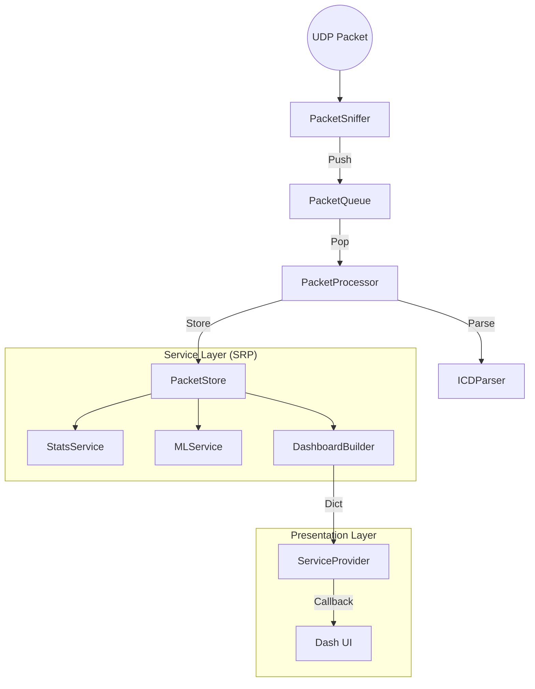

# UGV-MON: VIC↔OCS 실시간 통신 모니터링

VIC(차량연동통제기)와 OCS(운용통제기) 간 UDP 통신을 **수동 감시**하는 대시보드.

> **주의**: 이 시스템은 제어 패킷을 전송하지 않습니다. 오직 모니터링만 수행합니다.

## 핵심 기능

- **실시간 패킷 캡처**: lo (로컬) 또는 eno2/eno3 (실장비) 인터페이스
- **ICD v1.0 파싱**: 헤더, 운용 상태, 장치 연결, 비상정지 원인 해석
- **품질 지표**: 가용성, 지터(P95), 패킷 손실률, PPS
- **대시보드**: Dash + Plotly 기반 실시간 UI (2초 폴링)
- **양방향 캡처**: 상태(VIC->OCS) / 제어(OCS->VIC) 방향 전환

## 빠른 시작

### 1. 설치

```bash
pip install -r requirements.txt
```

### 2. 실행

#### Mock 모드 (개발/테스트용)

```bash
python3 run.py
python3 run.py --mode mock
```

- 가짜 데이터로 UI 확인
- 네트워크 권한 불필요

#### Live 모드 (실제 패킷 캡처)

```bash
# CLI 인자 방식 (권장)
sudo python3 run.py --mode live --interface lo
sudo python3 run.py --mode live --interface eno2

# 환경변수 방식
export UGV_MON_USE_LIVE=true
export UGV_MON_INTERFACE=lo
sudo -E python3 run.py
```

### 3. 접속

```
http://localhost:8050
```

## CLI 옵션

```bash
python3 run.py --help

options:
  --mode {mock,live}, -m    실행 모드 (기본: mock)
  --interface, -i           네트워크 인터페이스 (기본: lo)
  --port, -p                서버 포트 (기본: 8050)
  --debug                   디버그 모드 활성화
```

## 환경변수

| 변수명              | 설명               | 기본값    |
| ------------------- | ------------------ | --------- |
| `UGV_MON_USE_LIVE`  | `true`면 Live 모드 | Mock 모드 |
| `UGV_MON_INTERFACE` | 캡처 인터페이스    | `lo`      |
| `UGV_MON_PORT`      | 서버 포트          | `8050`    |
| `UGV_MON_DEBUG`     | 디버그 모드        | `false`   |

## 프로젝트 구조

```text
opus1/
├── run.py                    # 통합 진입점 (CLI 지원)
├── requirements.txt          # 의존성 목록
│
├── tests/                    # 단위 테스트
├── docs/                     # 문서
│
└── ugv_mon/                  # 메인 Python 패키지
    ├── app.py                # Dash 앱 팩토리
    ├── config.py             # 앱 설정 (환경변수)
    ├── constants.py          # 상수 정의
    ├── models.py             # 데이터 모델 (Enum, ICD 파싱)
    ├── styles.py             # UI 스타일 상수
    │
    ├── pipeline/             # 데이터 수집 파이프라인
    │   ├── sniffer.py        # PacketSniffer (Scapy)
    │   ├── queue.py          # PacketQueue (thread-safe)
    │   ├── processor.py      # PacketProcessor (파싱+저장)
    │   └── icd_parser.py     # ICDParser (ICD v1.0)
    │
    ├── store/                # 데이터 저장소
    │   └── packet_store.py   # 통합 저장 (단일 deque)
    │
    ├── services/             # 서비스 레이어
    │   ├── capture_service.py    # 캡처 제어
    │   ├── stats_service.py      # 통계/연결 상태
    │   ├── ml_service.py         # ML 이상 탐지
    │   ├── dashboard_builder.py  # Dict(25키) 빌드
    │   └── service_provider.py   # 콜백 호환 브리지
    │
    ├── analysis/             # ML 이상 탐지
    │   ├── ml_pipeline.py
    │   ├── ml_anomaly_detector.py
    │   ├── rule_detector.py
    │   └── feature_extractor.py
    │
    ├── ui/                   # UI 모듈
    │   ├── components/       # 재사용 컴포넌트
    │   │   ├── kpi_card.py
    │   │   ├── device_grid.py
    │   │   ├── status_chip.py
    │   │   └── log_table.py
    │   ├── layouts/          # 레이아웃
    │   │   ├── main_layout.py
    │   │   ├── header.py
    │   │   ├── panels.py
    │   │   ├── charts.py
    │   │   └── ml_charts.py
    │   └── ml/               # ML 시각화
    │       ├── anomaly_3d.py
    │       ├── anomaly_timeline.py
    │       └── feature_importance.py
    │
    ├── callbacks/            # Dash 콜백
    │   └── update_callbacks.py
    │
    └── mock/                 # ⚠️ 개발/테스트용
        ├── mock_data.py
        └── live_provider.py  # LEGACY (호환용)
```

## 아키텍처 (데이터 흐름)



1. **Pipeline**: `Sniffer`가 패킷을 잡아 `Queue`에 넣고, `Processor`가 꺼내서 파싱 후 `Store`에 저장.
2. **Service**: `StatsService`와 `MLService`가 `Store`의 데이터를 분석.
3. **Presentation**: `DashApp`이 2초마다 `ServiceProvider`를 통해 분석된 데이터를 조회하여 UI 갱신.
4. **Pipeline**: `Sniffer`가 패킷을 잡아 `Queue`에 넣고, `Processor`가 꺼내서 파싱 후 `Store`에 저장.
5. **Service**: `StatsService`와 `MLService`가 `Store`의 데이터를 분석.
6. **Presentation**: `DashApp`이 2초마다 `ServiceProvider`를 통해 분석된 데이터를 조회하여 UI 갱신.

## 테스트

### 단위 테스트 실행

```bash
pytest tests/
```

### Mock 모드 실행 (UI 테스트)

```bash
python3 run.py
```

## 문서

- `docs/00_PROJECT_OVERVIEW.md` - 프로젝트 개요
- `docs/01_ARCHITECTURE.md` - 아키텍처 구조
- `docs/02_FILE_STRUCTURE.md` - 파일별 역할
- `docs/03_ICD_SPECIFICATION.md` - ICD v1.0 파싱 규격
- `docs/04_KPI_METRICS.md` - KPI 정의 및 분석
- `docs/05_ML_ANOMALY_DETECTION.md` - ML 이상 탐지
- `docs/06_DATA_FLOW_GUIDE.md` - 데이터 흐름 가이드
- `docs/07_OJT_WEEKLY_LOGS.md` - OJT 실습 일지 (8주)
- `docs/Final_Project_Report.md` - 최종 프로젝트 보고서
